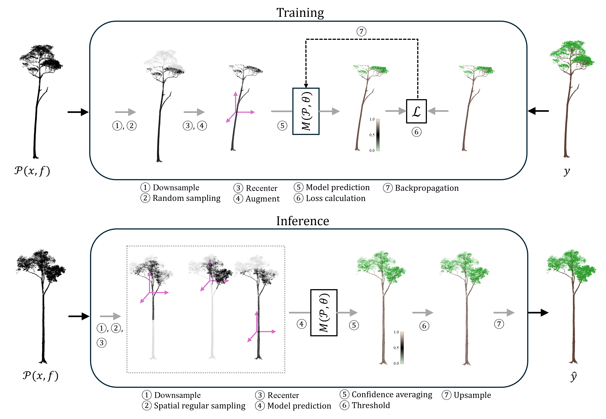
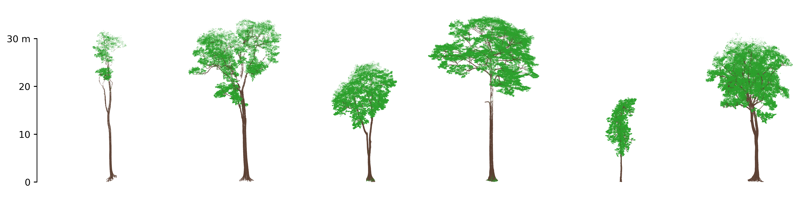

# Leaf-wood segmentation of tree point clouds with deep learning

[**Requirements**](#requirements) \| [**Structure**](#repository-structure) \| [**Data**](#data) \| [**Installation**](#installation) \| [**Inference**](#using-a-trained-model-for-segmenting-new-data) \| [**Training**](#training-a-model) \| [**Cite**](#cite)

Repository with the code for the paper "[Pointwise Deep Learning for Leaf-Wood Segmentation of Tropical Tree Point Clouds from Terrestrial Laser Scanning]()", which is currently under review. **Data and trained model weights will be made publically available upon acceptance.** More documentation will be added soon.

<!--  -->

## Requirements

Code was tested with Ubuntu 22.04 and using an NVIDIA graphics card. This repo uses the python programming language, largely based on the [Open3D-ml](https://github.com/isl-org/Open3D-ML) (pytorch backend) library for 3D deep learning.

## Repository structure

The repo is organized as follows:

```
├─ cfg                # Configuration files for training and running the deep learning models
├─ docker             # All files for running this repo with docker
├─ notebooks          # Accompanying notebooks with code for the paper (pre-/post processing, visualisation, ...)
├─ scripts            # Python scripts that can be run on command line for training and inference of the model
├─ src                # Python functions and classes organised into a package 
├─ logs               # Logging data including data cache and training checkpoints
├─ train_log          # Tensorboard training logs
└─ data                    
    ├─ your_data      # Your unlabeled tree point cloud
        ├─ pointcloud_1.txt
        ├─ ...
    └─ predictions    # Your tree point clouds with predicted label
        ├─ pointcloud_1.txt
        ├─ ... 
               
```

## Data

<!--  -->

The dataset used in the paper can be found [here](https://doi.org/10.5281/zenodo.13759407)

The data is organized as follows:

```
└─ data                   
    ├─ train
        ├─ labeled_point_cloud_train_1.txt
        ├─ ...
    ├─ validation
        ├─ labeled_point_cloud_val_1.txt
        ├─ ...
    └─ test
        ├─ labeled_point_cloud_test_1.txt
        ├─ ...                   
```

The expected point cloud format is three columns with the local x, y, z coordinates respectively, and a fourth column with the label (0 = leaf, 1 = wood).

```
67.511 78.495 -10.344 1.000
67.482 78.482 -10.326 1.000
67.500 78.525 -10.309 1.000
67.645 78.406 -10.344 0.000
67.643 78.409 -10.322 0.000
...
```

## Installation

We give instructions for setting up this repo with either a Conda environment or using a Docker image.

### Using Conda environment

It is assumed that you have anaconda/miniconda installed. 

Write/paste the following commands in a linux terminal.

1. Make a new environment (e.g. called 'leafwood') and activate the environment:
```
conda create -n leafwood python==3.8
conda activate leafwood
```
2. install required packages:
```
conda install pytorch==1.13.1 torchvision==0.14.1 pytorch-cuda=11.6 -c pytorch -c nvidia
pip install open3d==0.17.0 scikit-learn==1.2.1 tensorboard
```
3. Install a fork of the open3D-ml package (for example under a folder called 'repo' )
```
mkdir ~/repo
cd ~/repo
git clone https://github.com/woutervdbroeck/Open3D-ML
pip install -e .
```
4. Clone this repository locally (for example under a folder called 'project') and install the src code in this repo as a package 
```
mkdir ~/project
cd ~/project
git clone git+https://github.com/qforestlab/leaf-wood-segmentation-with-deep-learning@main
cd leaf-wood-segmentation-with-deep-learning
pip install -e .
```

### Using Docker

#### For Windows

For Windows we recommend using WSL. Docker on Windows does not support using a GPU.

 Install WLS and/or make sure you have the latest version (in PowerShell or windows command prompt: ```wsl --install``` or ```wsl --update```).

#### For Linux / in WSL
1. make sure you have the latest NVIDIA driver. 
> For WSL you have to install the latest correct NVIDIA drivers for Windows and not Linux ! 
2. Install Docker with Docker Compose
3. Install [NVIDIA toolkit](https://docs.nvidia.com/datacenter/cloud-native/container-toolkit/install-guide.html#docker) for Docker (to allow gpu usage in docker container) 
4. Clone this repository locally (write/paste in a linux terminal):
```
git clone git+https://github.com/qforestlab/leaf-wood-segmentation-with-deep-learning@main
```
5. In this repo check your data path in the `docker/docker-compose.yml` file (under -volumes)
6. In this repo, navigate to the docker directory and start the docker image:
```
cd leaf-wood-segmentation-with-deep-learning/docker
bash docker.sh
```

Building the image might take a while. Once finished, a bash shell running inside the docker container should be available. 

## Using this repo

Everything should be specified in a a yammel config file in the cfg directory. See next two sections for more information on the different fields, for inference or training.

```
dataset:           # Dataset configurations
  field_1: ...
  field_2: ...
  ...
model:            # Model configurations
  field_1: ...
  field_2: ...
  ...
pipeline          # Training/inference pipeline configurations
  field_1: ...
  field_2: ...
  ...
```

## Using a trained model for segmenting new data 

> [!NOTE]
> Supported file formats for point clouds are `.txt`, `.npy`, and `.ply`. 

Specify everything in the config file. Minimum requirements are the following:

 **dataset**
> ```dataset_path```: 

> ```test_dir```:

> ```test_result_folder```:

**model**
> ```name```: 

> ```ckpt_path```: 
>
> You can download model weights [here](https://zenodo.org/records/13767795).

> ```is_resume```: 

> ```in_channels```:

> ```num_classes```: 

> ```voxel_size```: 

> ```max_voxels```: 

**pipeline**
> ```device```: 

> ```batch_size```: 


\
**You can run inference on new data as follows:**
```
python scripts/infer.py cfg/name_of_config_file.yml
```


## Training a model

> [!IMPORTANT]
> For training, the point clouds are assumed to be in `.npy` format !! So make sure to convert your data from txt/ply/las to npy.

In addition to specifying the settings above, for training the following fields should also be set:

**dataset**
> ```class_weights```: 

> ```train_dir```:

> ```val_dir```:

**pipeline**
> ```val_batch_size```: 

\
**Training is started as follows:**
```
python scripts/train.py cfg/name_of_config_file.yml
```

The training and validation curves can be followed/visualised using tensorboard (assuming the tensorboard logs are stored in ```./train_log```):

```
tensorboard --logdir=train_log 
```

## Cite
<!-- ```bib
@article{VandenBroeck2024,
  title={Pointwise Deep Learning for Leaf-Wood Segmentation of Tropical Tree Point Clouds from Terrestrial Laser Scanning},
  author={Wouter A. J. Van den Broeck and Louise Terryn and Shilin Chen and Wout Cherlet and Zane T. Cooper and Kim Calders},
  journal={},
  year={2024},
  url = {\url{}}
}
``` -->

## TODO

- clean up train and inference script
- clean up config files
- describe different fields in config file in this readme
<!-- - run test inference and training (with all data ?) -->